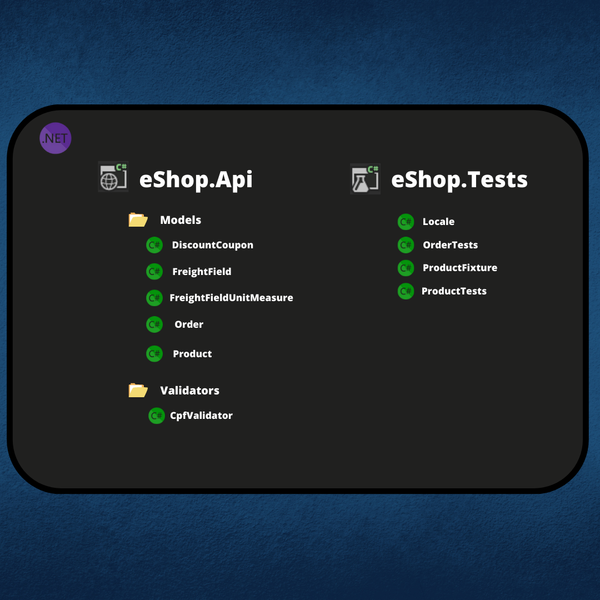
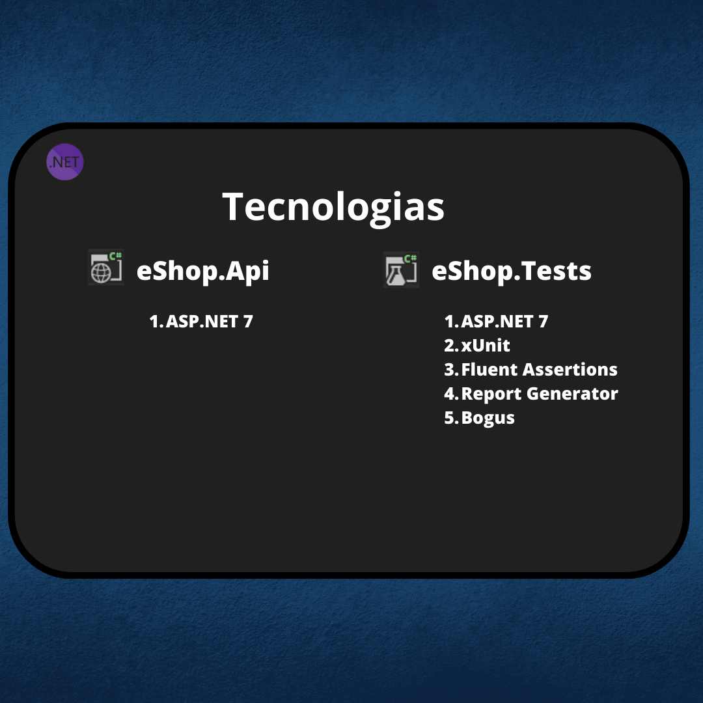

# Sistema de vendas online

# Visão geral

Vamos implementar um sistema de vendas online com a possibilidade de realizar pedidos com múltiplos itens, cada um deles com uma quantidade variável,
calculando o frete, os impostos, aplicando um cupom de desconto e ainda interagindo com o estoque. Além disso, teremos ainda fluxos de pagamento 
e cancelamento do pedido realizado.

# Projeto - Parte 01

## Testes

1. Deve criar um pedido com 3 produtos (com descrição, preço e quantidade) e calcular o valor total
2. Deve criar um pedido com 3 produtos, associar um cupom de desconto e calcular o total (percentual sobre o total do pedido)
3. Não deve criar um pedido com cpf inválido (lançar algum tipo de erro)

# Projeto - Parte 02

## Testes
1. Não deve aplicar cupom de desconto expirado
2. Ao fazer um pedido, a quantidade de um item não pode ser negativa
3. Ao fazer um pedido, o mesmo item não pode ser informado mais de uma vez
4. Nenhuma dimensão do item pode ser negativa
5. O peso do item não pode ser negativo
6. Deve calcular o valor do frete com base nas dimensões (altura, largura e profundidade em cm) e o peso dos produtos (em kg)
7. Deve retornar o preço mínimo de frete caso ele seja superior ao valor calculado

## Considere
- O valor mínimo é de R$10,00
- Por enquanto, como não temos uma forma de calcular a distância entre o CEP de origem e destino, será de 1000 km (fixo)
- Utilize a fórmula abaixo para calcular o valor do frete
- Valor do Frete = distância (km) * volume (m3) * (densidade/100)

## Design

## Arquitetura

O sistema está sendo desenvolvido com ASP.NET 7, sem ainda ter separações claras entre camadas, exceto a existente entre a aplicação e os testes.
Para o projeto de testes foi utilizado o framework xUnit, junto com a biblioteca Fluent Assertions, responsável por deixar a leitura dos testes mais fácil.
Também foi utilizado o pacote Report Generator para gerar um relatório de cobertura de testes.
Na prática 02 foi incluída a biblioteca Bogus para facilitar a criação de dados para os testes de unidade

--------------------------------------------

# Disclaimer
Este repositório foi criado com o intuito de colocar em prática conhecimentos adquiridos no curso de 
Clean Code e Clean Architecture do Rodrigo Branas (https://app.branas.io/public/products/bf60d5e1-2af4-4d5d-8173-40944b292b21)